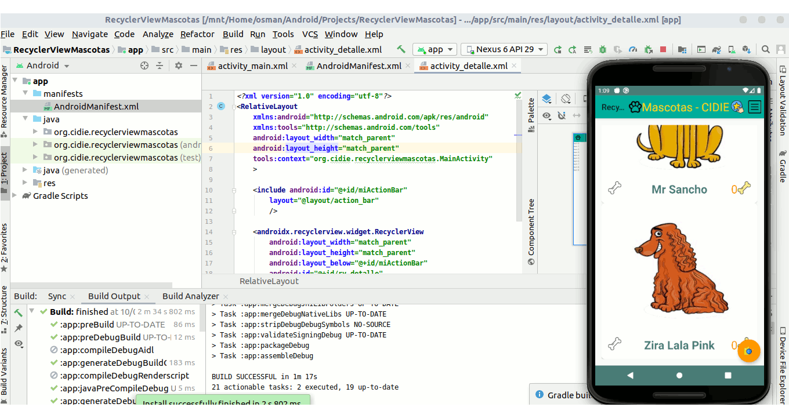

# RecyclerViewMascotas
Genera un RecyclerView que muestre una lista de mascotas 

Actividad 1 - MainActivity
Analiza la entidad “Mascota” .
Genera un RecyclerView que muestre una lista de 10 mascotas como se observa en las imágenes.
Cada mascota puede ser raiteada usando el ícono de hueso en blanco en comparación con el hueso amarillo
que nos muestra la cantidad de raiting que tiene cada mascota.
Crea un Action View en forma de estrella parte superior derecha en la AppBar - NUESTRO BOTÓN de "Siguiente - Actividad 2" (Detalle).
Nuestro AppBar utiliza Material Design con identidad personalizada - @CIDIE Mascotas

Actividad 2 - Detalle
Visualiza un RecyclerView con 5 mascotas raiteadas
Se especifica el gusto por la mascota con número en el ícono hueso amarillo
Además, la actividad 2 que muestra las mascotas favoritas, contiene la posibilidad de regresar al Activity padre (Actividad 1).
Clic en Botón Regresar (Back) - MainActivity (Actividad 1)
BOTÓN "Editar Datos".

Se anexan imágenes (RecyclerViewMascotas) en directorio raíz de ejemplos al ejecutar aplicación en Android Studio.

Android-Manifest:

    defaultConfig {
        applicationId "org.cidie.recyclerviewmascotas"
        minSdkVersion 21
        targetSdkVersion 29
        versionCode 1
        versionName "1.0"
        testInstrumentationRunner "androidx.test.runner.AndroidJUnitRunner"
    }

## Captura de Pantalla - Formulario Contacto

    

        
    

 
