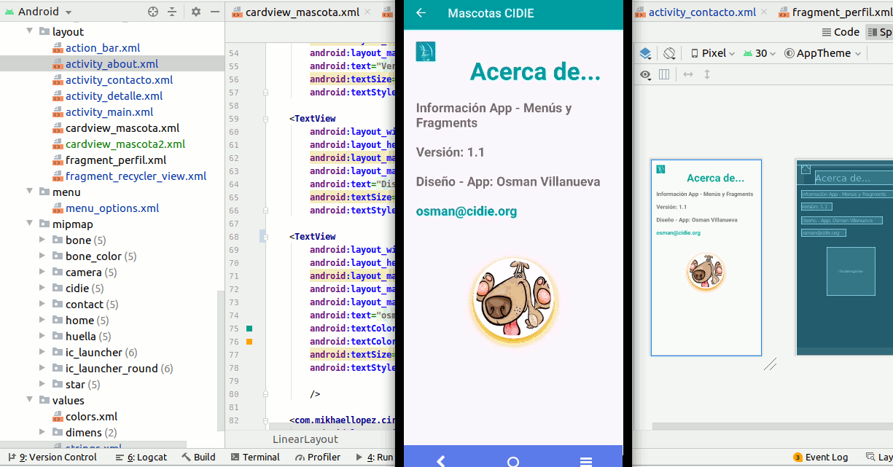

# Mascotas CIDIE (Versión 1.1)

AGREGANDO Base de Datos y MVP ( Modelo Vista Presentador) al proyecto anterior:

Son 10 mascotas que cambian conforme el usuario da rating a una o varias, mascotas. Contiene actividad de "Contacto" y "About" con librerías javaMailpara enviar mensajes en el diseño de la App. 

En el POJO de la entidad "mascota" se genera un dentificador único que permite diferenciar una mascota de otra.

La App crea y consulta Base de Datos a partir de una tabla llamada "MASCOTA" idéntica al POJO de "mascota", de tal forma que cuando una persona de "rating" a una imagen se guardan los datos completos de la entidad en la base de datos (sqlite3). 

## Captura de Pantalla - RecyclerView Mascotas - BDatos - Modelo Vista Presentador (MVP) con Menús y Fragments.

    

        
    

 

### Clic para ver el Video de funcionalidad App - 

 con Menús y Fragments - Click to Watch!")

 

________________________________________________________________

# Mascotas CIDIE (versión 1.1)

Partiendo del proyecto anterior se agregaron Menús y Fragments.

AGREGANDO MENÚS:
Creación de un menú de opciones que muestre el Item "Contacto" y el Item "About" (Acerca de...).
Se incluye ActionView en menú con imagen de "Star" en ActionBar con enlace a Actividad Detalles - mascotas favoritas.

Menú - Contacto: Actividad de una pantalla con un formulario que solicita el nombre, el correo y mensaje (utiliza los EditText de Material Design),
Además un botón de "Enviar Comentario" el cual toma la información recopilada y con ayuda de la librería JavaMail envía un mail con el comentario del contacto.
Este es el enlace con la documentación de JavaMail: https://java.net/projects/javamail/pages/Android

Menú - About (Acerca De): Actividad de una pantalla con la Bio del desarrollador.

AGREGANDO FRAGMENTS:
Se modulariza el proyecto anterior en Fragments para que estos puedan ser mostrados en un ViewPager. Y se crea un Fragment Adicional que muestre el perfil de nuestra mascota. Tendrá su foto de perfil, su nombre y un RecyclerView en donde se mostrarán todas las fotos que ha subido se acomodarán en forma de Grid.

Se agregó Botón de Regresar (Back) - en cada Actividad adicional (Contacto, About y Detalles) de MainActivity (Actividad 1).

Se anexan imágenes (RecyclerViewMascotas) de actualización de App (Mascotas) y ejemplos al ejecutar aplicación en Android Studio 4.0.1.

Android- Build Gadle:
    
    android {
    compileSdkVersion 30
    buildToolsVersion "30.0.2"
    
    defaultConfig {
        applicationId "org.cidie.mascotas"
        minSdkVersion 21
        targetSdkVersion 30
        versionCode 1
        versionName "1.1"
        testInstrumentationRunner "androidx.test.runner.AndroidJUnitRunner"
    }
    }

## Captura de Pantalla - RecyclerView Mascotas - Menús y Fragments

    

        
    

 

_________________________________________________________________________________________

# RecyclerViewMascotas (versión 1.0)

Genera un RecyclerView que muestre una lista de mascotas 

Actividad 1 - MainActivity
Analiza la entidad “Mascota” .
Genera un RecyclerView que muestre una lista de 10 mascotas como se observa en las imágenes.
Cada mascota puede ser raiteada usando el ícono de hueso en blanco en comparación con el hueso amarillo
que nos muestra la cantidad de raiting que tiene cada mascota.
Crea un Action View en forma de estrella parte superior derecha en la AppBar - NUESTRO BOTÓN de "Siguiente - Actividad 2" (Detalle).
Nuestro AppBar utiliza Material Design con identidad personalizada - @CIDIE Mascotas

Actividad 2 - Detalle
Visualiza un RecyclerView con 5 mascotas raiteadas
Se especifica el gusto por la mascota con número en el ícono hueso amarillo
Además, la actividad 2 que muestra las mascotas favoritas, contiene la posibilidad de regresar al Activity padre (Actividad 1).
Clic en Botón Regresar (Back) - MainActivity (Actividad 1)
BOTÓN "Editar Datos".

Se anexan imágenes (RecyclerViewMascotas) en directorio raíz de ejemplos al ejecutar aplicación en Android Studio.

Android-Manifest:

    defaultConfig {
        applicationId "org.cidie.recyclerviewmascotas"
        minSdkVersion 21
        targetSdkVersion 29
        versionCode 1
        versionName "1.0"
        testInstrumentationRunner "androidx.test.runner.AndroidJUnitRunner"
    }

## Captura de Pantalla - RecyclerView Mascotas

    

        
    

 
